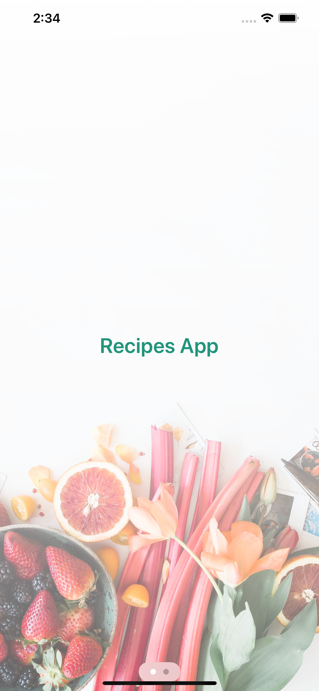
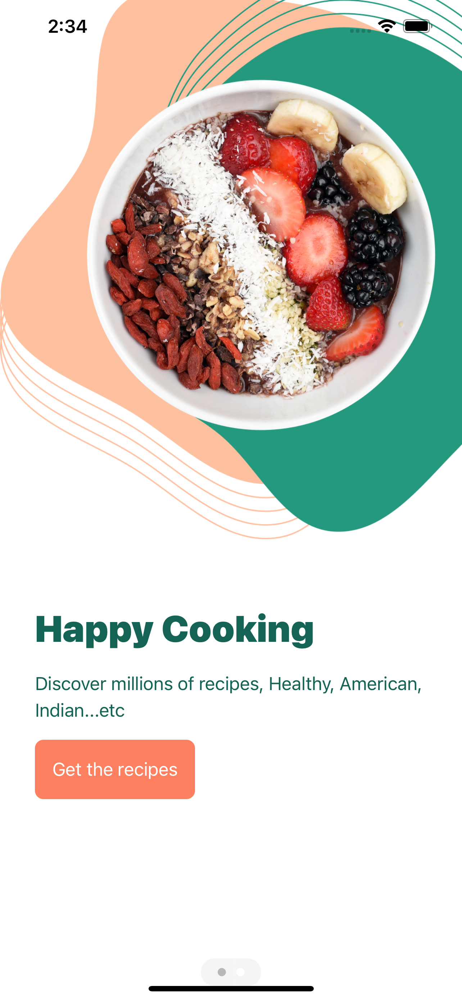
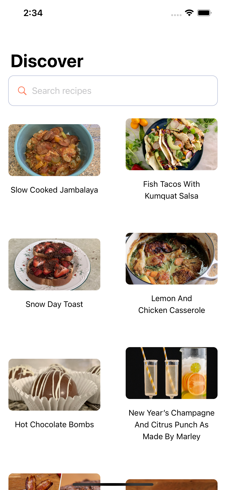

# Recipes App With SwiftUI

  
  
  

# Features
* Utilizing TasteyApi
* Onboarding Screens
* Search bar to look up recipes
* Pagination
* Utilizing the new AsyncImage introduced in IOS 15
* Utilizing AVkit
